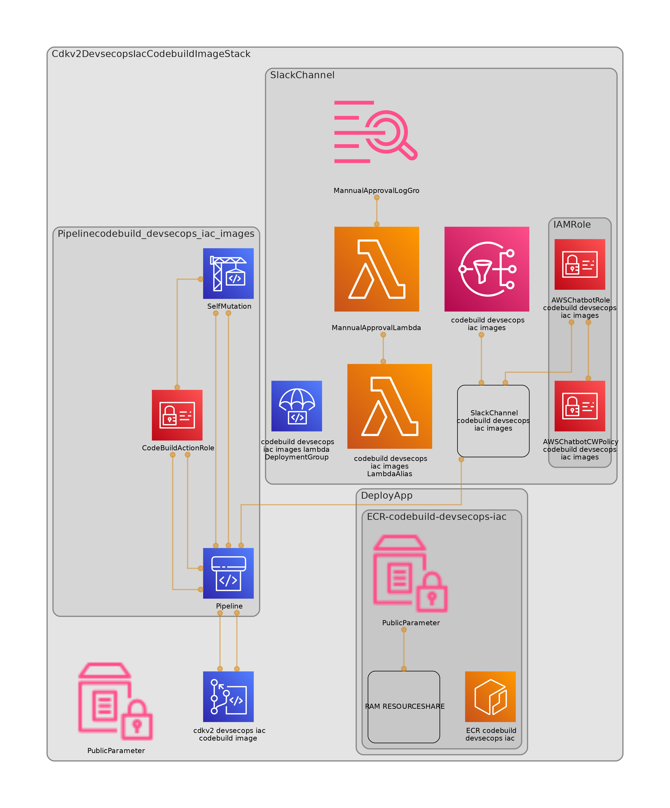

<!-- START doctoc generated TOC please keep comment here to allow auto update -->
<!-- DON'T EDIT THIS SECTION, INSTEAD RE-RUN doctoc TO UPDATE -->
**Table of Contents** 

- [CodeBuild DevSecOps Container Image for IaC Deployments](#codebuild-devsecops-container-image-for-iac-deployments)
    - [AWS Services](#aws-services)
    - [Reference Architecture Diagram](#reference-architecture-diagram)
    - [Code Diagram structure](#code-diagram-structure)
    - [How To](#how-to)
      - [Modify project options](#modify-project-options)
      - [Create commit changes and push](#create-commit-changes-and-push)
      - [Deploy manual project](#deploy-manual-project)
  - [Useful commands](#useful-commands)

<!-- END doctoc generated TOC please keep comment here to allow auto update -->


# CodeBuild DevSecOps Container Image for IaC Deployments

### AWS Services


- [AWS Cloud Development Kit (CDK)](https://aws.amazon.com/cdk/): is an open-source software development framework to define your cloud application resources using familiar programming languages.
- [AWS Identity and Access Management (IAM)](https://aws.amazon.com/iam/?nc2=h_ql_prod_se_iam): Securely manage identities and access to AWS services and resources.
- [AWS IAM Identity Center (Successor to AWS Single Sign-On)](https://aws.amazon.com/iam/identity-center/): helps you securely create or connect your workforce identities and manage their access centrally across AWS accounts and applications.
- [AWS CodeBuild](https://aws.amazon.com/codebuild/): fully managed continuous integration service that compiles source code, runs tests, and produces software packages that are ready to deploy.
- [AWS CodeCommit](https://aws.amazon.com/codecommit/): secure, highly scalable, managed source control service that hosts private Git repositories.
- [AWS CodePipeline](https://aws.amazon.com/codepipeline/): fully managed continuous delivery service that helps you automate your release pipelines for fast and reliable application and infrastructure updates.
- [AWS Key Management Service (AWS KMS)](https://aws.amazon.com/kms/): lets you create, manage, and control cryptographic keys across your applications and more than 100 AWS services.
- [AWS CloudFormation](https://aws.amazon.com/cloudformation/): Speed up cloud provisioning with infrastructure as code

### Reference Architecture Diagram


Figure 1. Solution architecture diagram

The Figure 1 depicts the architecture solution and the steps to accomplish this task. Also, it shows a cross account pipeline using AWS CodePipeline, AWS CodeCommit, AWS Codebuild and AWS CloudFormation. But, how can you construct this pipeline secure and with the minimum effort? The answer CDK Pipelines.

1- The changes are detected and activate the pipeline. For this demo the branch master is the default branch.

2-The CDK project is synthesized if is aligned with AWS Security Best practices.

3-The pipeline run self-update action.

4-The unit test runs, and its report is published in codebuild reports group.

5-The SAST runs, and its report is published in codebuild reports group.

6-The Cloudformation stack is prepared for shared environment.

7-The Cloudformation stack is deployed for shared environment after success result from Cloudformation hooks, this create ECR repository and put the custom resources policies for different scenarios (Codebuild projects, organization units and individual accounts).

8-To move to other step a manual approval step is added, the notification is sent to slack channel.

9-The image is created and publish to ECR Repository.

### Code Diagram structure

The Figure 2 depicts the code structure for this project.



Figure 2 . Code Structure


### How To
> Deployment General Steps

#### Modify project options
Modify [environment_options.yaml](project_configs%2Fenvironment_options%2Fenvironment_options.yaml) with the valid values for the environment.

For example:

```yaml
#Designed for pipeline and parameters secrets
environments:
  - environment: 'prod'
    deployment_account: '124962754123'
    deployment_region: "us-east-2"
    partner_review_email:
      - 'someone@mycmpany.com'

ecr_repository_properties:
  - repository_name: "codebuild_devsecops_iac"
    lifecycle_rule:
      tags_prefix:
        - "prod"
        - "dev"
      max_images: 10
    resource_policy:
      accounts:
        - account_id: "124962754124"
          type: "read"
      ous:
        - id: "o-xxxxxxxxxx/*/ou-xxxx-xxxxxxxx/*"
          type: "read"
      
    deploy_app: "True"
    app_properties:
      build_spec_path: "../app/buildspec.yaml"
      version: "1.1.0"

```
In the previous code you can find the abstraction and properties for sharing ECR  repository

> Visit [Private repository policy examples](https://docs.aws.amazon.com/AmazonECR/latest/userguide/repository-policy-examples.htm) for more about resource policies in ECR.

#### Create commit changes and push 

Create commit and push your changes to master branch or create pull request.

#### Deploy manual project
This is a project for CDK development with Python.

The `cdk.json` file tells the CDK Toolkit how to execute your app.

This project is set up like a standard Python project.  The initialization
process also creates a virtualenv within this project, stored under the `.venv`
directory.  To create the virtualenv it assumes that there is a `python3`
(or `python` for Windows) executable in your path with access to the `venv`
package. If for any reason the automatic creation of the virtualenv fails,
you can create the virtualenv manually.

To manually create a virtualenv on MacOS and Linux:

```
$ python3 -m venv .venv
```

After the init process completes and the virtualenv is created, you can use the following
step to activate your virtualenv.

```
$ source .venv/bin/activate
```

If you are a Windows platform, you would activate the virtualenv like this:

```
% .venv\Scripts\activate.bat
```

Once the virtualenv is activated, you can install the required dependencies.

```
$ pip install -r requirements.txt
```

At this point you can now synthesize the CloudFormation template for this code.

```
$ cdk synth
```

To add additional dependencies, for example other CDK libraries, just add
them to your `setup.py` file and rerun the `pip install -r requirements.txt`
command.

## Useful commands

 * `cdk ls`          list all stacks in the app
 * `cdk synth`       emits the synthesized CloudFormation template
 * `cdk deploy`      deploy this stack to your default AWS account/region
 * `cdk diff`        compare deployed stack with current state
 * `cdk docs`        open CDK documentation

Enjoy!
